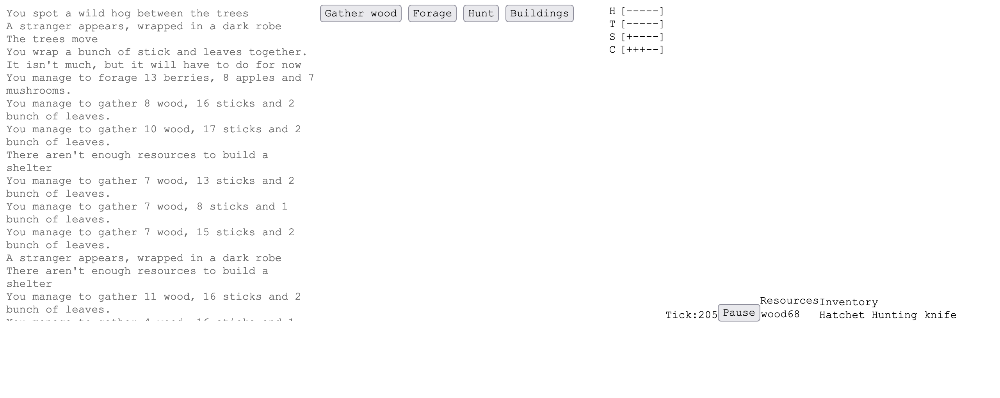

### So... What is it?

You may know a browser game called [A Dark Room](https://adarkroom.doublespeakgames.com/). Well, I wanted to see how I would approach development of a similar title. And maybe learn to love Javascript while at it. I had a vague idea of what I wanted from it, enough to code the basics in a rough form:

- Stats (Thirst, Hunger etc)

- Inventory

- Events

- Player actions

- Time

- Season changes (only in the name, no real effect implemented)

- GUI (as much as ASCII characters can be called a GUI)

Being a text-based game, focus is on the events that drive the story. But without having an actual script to drive the story forward I stopped working on the project. I think 70% of the time spent developing this game from now on would be writing text, rather than adding gameplay mechanics.

### Screenshot
